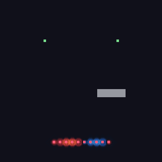
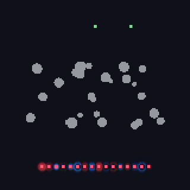
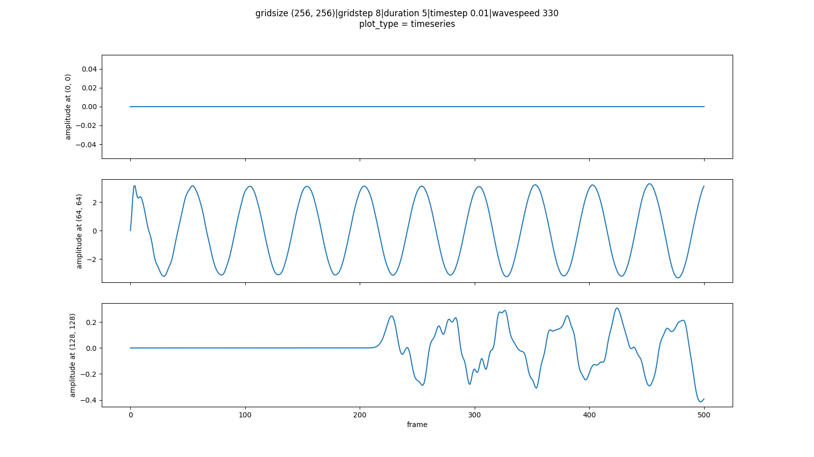
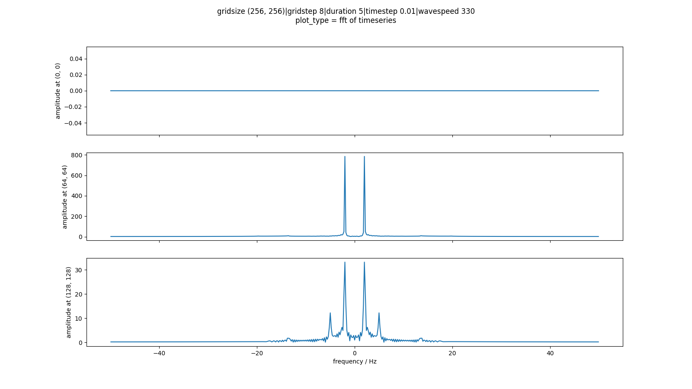
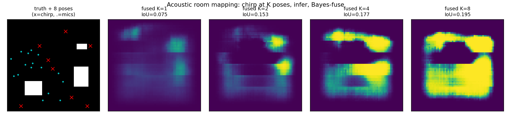

# Acoustic Simulation & Sensing

A finite-difference time-domain (FDTD) simulator for acoustic waves in
2D and 3D. On top of it the repo builds a machine-learning pipeline that
maps a room from sound (echolocation). The long-term goal is a closed
loop: sense a room with a laptop's speakers and mics, then shape the
sound field in it (directed audio, local quiet). The roadmap is in
[`PROJECT_PLAN.md`](PROJECT_PLAN.md) and the live status in
[`CURRENT_STATE.md`](CURRENT_STATE.md).

**[Try it in the browser →](https://kyleyhw.github.io/sound_simulation/)** No install needed: the
simulator, gallery, control panel, closed-loop demo and room-measurement
lab all run in the page.

<p align="center">
  
  
</p>
<p align="center"><sub>Left: acoustic contrast control makes one spot loud and a nearby spot silent (58 dB), with a rigid table in the way. Right: 16 speakers replay reversed recordings of a pulse, which refocus on the source through a cluster of scatterers. Both GIFs are rendered from the gallery scenes by <code>npm run render</code>.</sub></p>

## What is here

| Component | Location | Summary |
| --- | --- | --- |
| FDTD engine | `src/acoustic_system/simulation/` | Step-at-a-time leap-frog solver (`Simulate`) with fused numba kernels in 2D and 3D. Covers rigid, impedance and pressure-release walls, a CPML, a sponge, Mur edges, c(x), SI units, sub-cell and directional sources, and a differentiable batched PyTorch twin. Optional CUDA backend. Verified against analytic results in [`docs/physics.md`](docs/physics.md). |
| Web app | `web/` | The Acoustic Sandbox: the same engine in TypeScript and WebGPU, run in the browser with no server. Hosted on GitHub Pages. It has the sandbox (draw rooms, sources, mics; listen; share), a 15-scene gallery, explainers, the sound-field control panel, in-browser room sensing, the closed-loop demo, the room-measurement Lab and a docs site. |
| Room sensing | `src/acoustic_system/imaging/`, `learning/` | Physics imagers (deconvolution, echo ellipses, back-projection, time reversal, FWI), the Phase 2 CNNs, and the [benchmark](docs/benchmark.md) against a no-audio baseline. |
| Sound-field control | `src/acoustic_system/control/` | Transfer functions from the engine; sound zones (DAS, pressure matching, ACC); crosstalk cancellation; FxLMS noise cancellation; sensing requirements; differentiable control. |
| Real rooms | `web/src/lab/`, `scripts/eval_real_captures.py` | Laptop-only measurement of impulse responses, echoes and T60, with device calibration, a room twin and virtual headphones. |
| Checks | `tests/`, `web/tests/` | pytest (engine, physics, sensing, control), Vitest and Playwright. CI runs all of them. |
| Docs | `docs/` | One page per module ([`docs/index.md`](docs/index.md)), plus reports in `tests/reports/` and the write-ups in `docs/writeups/`. |

**Results so far.** The first sensing CNNs scored exactly at a no-audio
baseline (IoU 0.10). Physics-based imaging beats that baseline by 19
standard errors (IoU 0.189, or 0.244 with 8 poses). Acoustic contrast
control reaches 25.5 dB between two zones in an absorbing room, and a
closed sense-and-control loop holds its contrast while the room changes.
See [the write-ups](https://kyleyhw.github.io/sound_simulation/#/research)
and [`CURRENT_STATE.md`](CURRENT_STATE.md).

## Quick start

The project uses [`uv`](https://docs.astral.sh/uv/):

```bash
uv sync --extra dev            # engine + web backend + toolchain
uv sync --extra dev --extra ml # + PyTorch for the sensing models
uv run pytest                  # all checks
```

Run the web app locally (it is also hosted on GitHub Pages):

```bash
cd web && npm install && npm run dev        # http://127.0.0.1:3000
```

Run a standalone batch simulation (plots the field and the sensor
traces):

```bash
cd src && uv run python -m acoustic_system.simulation.main
```

## Method

The solver integrates the scalar wave equation

$$ \frac{\partial^2 p}{\partial t^2} = c^2 \nabla^2 p $$

using the explicit leap-frog update

$$ p^{n+1} = 2p^n - p^{n-1} + (c\,\Delta t)^2\,\nabla^2_h p^n, $$

where $\nabla^2_h$ is the second-order central (5-point in 2D, 7-point in
3D) Laplacian. The scheme is stable when the Courant number satisfies
$c\Delta t/\Delta x \le 1/\sqrt{d}$ in $d$ dimensions. The constructor
picks a stable $\Delta t$ by default and warns when a user-supplied one
violates the bound.

The domain edges and the interior obstacles currently hold $p = 0$.
This is a **pressure-release** (acoustically soft) boundary with
reflection coefficient $-1$. Rigid walls ($\partial p/\partial n = 0$)
and absorbing boundaries are planned in Phase 5. See
[`docs/simulate.md`](docs/simulate.md) for the engine details and
[`docs/gpu.md`](docs/gpu.md) for the CUDA backend.

## Visuals

Pressure recorded at three sensors, and its spectrum:




Room mapping from K chirp poses (Bayes-fused CNN predictions):



## References

1. Schneider, J. B. *Understanding the FDTD Method*, ch. on acoustic FDTD. Washington State University. <https://eecs.wsu.edu/~schneidj/ufdtd/>
2. Kinsler, L. E., Frey, A. R., Coppens, A. B., & Sanders, J. V. (2000). *Fundamentals of Acoustics*. Wiley.
3. Press, W. H., Teukolsky, S. A., Vetterling, W. T., & Flannery, B. P. (2007). *Numerical Recipes* (3rd ed.). Cambridge University Press.

## License

MIT (see `pyproject.toml`).
