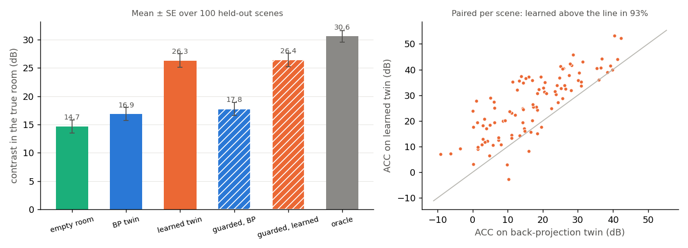
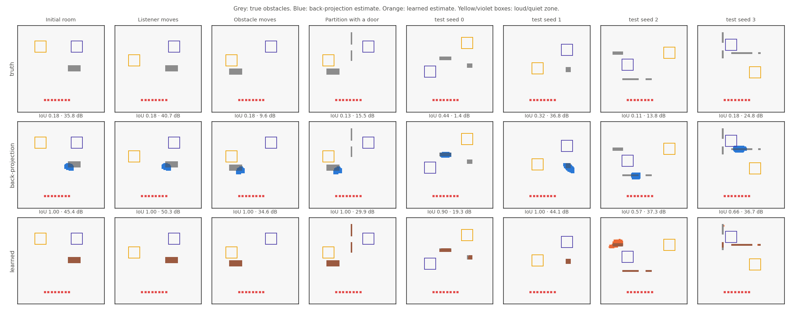
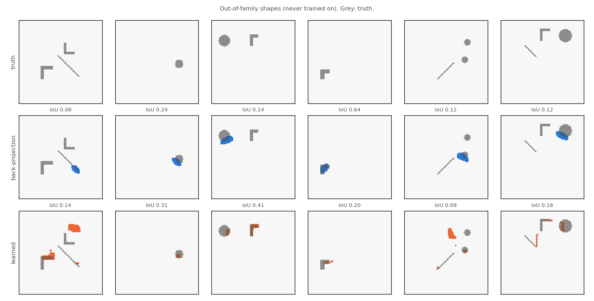

# Does better sensing close the control gap? Learned room estimate in the closed loop (2026-09-25)

**Question.** In the closed loop (`#/loop`, docs/web_app.md §5b), the twin
built from the back-projection estimate trails the oracle (a design on the
true room) by 10–15 dB. Does a learned room estimate close that gap?

**Answer.** On held-out rooms from the training family, it closes most of it.

| | value |
|---|---|
| learned estimate, IoU | 0.79 ± 0.02 (back-projection: 0.18 ± 0.01) |
| learned twin, contrast | 26.3 ± 1.2 dB (back-projection twin: 16.9 ± 1.2 dB) |
| paired Δ (learned twin − back-projection twin) | +9.5 ± 0.7 dB, z = 12.6 |
| oracle gap closed | 69 % |
| on the four demo epochs | IoU 1.00; the loop equals the oracle |

The gain does not carry over to shapes outside the training family (discs,
L-shapes, diagonal walls). There the control gain is +0.7 ± 1.0 dB
(z = 0.7): the network imposes its rectangle prior.

The estimator is shipped in the browser loop, back-projection stays
available as an option, and the monitor guard stays in place.

Artifacts: `loop_sensing_2026_09_25_artifacts/` (`results.json`,
`contrast.png`, `examples.png`, `iou_vs_gap.png`, `ood.png`).

## 1. Data

The data matches the loop's sensing exactly. It is generated by the
loop's own TypeScript code, run in Node
(`web/scripts/loop_sensing_data.ts`, `npm run loop:data`):

- **Setup.** The demo grid (100², CPML 12 cells), the 8-speaker bar at
  row 86, and a Ricker ping (f0 = 0.08) from each speaker. All eight bar
  positions record for 622 steps. The residual is taken against the
  empty-room recordings.
- **Images.** `closedLoop.migrationImages` computes five grid-aligned
  images per scene: the coherent delay-and-sum image, the coherent images
  of the left and right half of the array (by source), the smoothed
  coherent energy (the image back-projection thresholds), and the smoothed
  incoherent energy.
- **Scene family.** `scenarios.randomLoopScene` places 1–3 rigid objects,
  kept at least 12 cells from the array:
  - blocks of 4–12 × 4–18 cells (70 %);
  - partitions 2 cells thick and 18–36 long, with a 5–9-cell door
    (30 %), vertical or horizontal. Half the vertical ones start at the
    top edge, like the demo's.

  A bright and a dark zone (13 × 13 cells, as in the demo) are placed
  clear of the objects, with centres at least 28 cells apart.
- **Splits.** Train 2400, validation 300 and test 100 scenes, with seeds
  1e6 + i, 2e6 + i and 3e6 + i (disjoint). The four demo epochs are kept
  separately and never trained on. The data is in `data/loop_sensing/`
  (590 MB, gitignored). Generation takes 1.1 s per scene on one core.

## 2. Model

The model is `scripts/train_loop_sensing.py`. It is the compact U-Net of
`imaging/models.py` (`CompactUNet`, widths 12/24/48, bottleneck at 12²):
120 k parameters, 468 KiB as float32. It runs on the central 96² crop,
with 11 input channels:

- the three coherent images, divided by max |coherent|;
- the square roots of the two energy images, each divided by its max;
- the standardised log10 of the energy maximum (a constant plane);
- the row and column coordinates;
- the distance to the array centre;
- the array's near-field mask;
- the training prior logit, divided by 5.

The maxima are taken outside the near field. As in `AlignedUNet`, the
output logit is the prior logit plus the U-Net output.

Training ran on CPU with 2 threads: BCE + Dice, AdamW, one-cycle LR 3e-3,
batch 16, 40 epochs, at 35 s per epoch. The epoch and the probability
threshold (τ = 0.62) were both chosen on validation scenes only (best val
IoU 0.810 at epoch 36). The test split was scored once.

- **Export.** BatchNorm is folded into the convolutions. The folded
  network matches the model to 1e-4 in logit (a self-check in `export`).
  The files are `web/public/models/loop_unet.{bin,json}`.
- **Browser.** `web/src/loop/learnedSensing.ts` uses the existing
  `nn.ts` ops plus a new `upsampleNearest2`.
- **Parity.** `web/tests/unit/loopSensing.test.ts` re-simulates two test
  scenes and demo epoch 4 in TypeScript. Against the PyTorch fixture, the
  features agree to 1e-6 and the logits to 1.2e-4, at a logit scale of
  34–58.
- **Latency.** 0.27 s per estimate (mean of 104, Node, one thread).

## 3. Sensing on the test split (100 scenes, mean ± SE)

| estimator | IoU |
|---|---|
| no audio (training prior map, τ chosen on validation) | 0.036 ± 0.003 |
| back-projection (the loop's current estimate) | 0.180 ± 0.009 |
| **learned U-Net** | **0.785 ± 0.022** |

Learned minus back-projection: +0.606 ± 0.020 (z = 29.6). The learned
estimate is better in 100 % of scenes; the median IoU is 0.87, and 22 %
of scenes are reconstructed exactly. The Python IoU on the stored images
and the TypeScript loop's IoU on re-simulated scenes agree (0.785).

## 4. Closed loop, paired on 100 held-out scenes

`web/scripts/loop_sensing_eval.ts` (`npm run loop:eval`) runs every scene
through the browser code. Each scene is sensed once, and both estimators
use the same recordings. For every design (8 steady-state tones at
f = 0.05), the contrast is measured over the whole zones in the true room.
The guarded loops use the five-mic monitor guard of `runLoop`, choosing
between that twin's design and the empty-room design.

| design | contrast (dB) | below 10 dB |
|---|---|---|
| empty room (no sensing) | 14.7 ± 1.1 | |
| back-projection twin | 16.9 ± 1.2 | |
| guarded loop, back-projection | 17.8 ± 1.2 | 28 / 100 |
| **learned twin** | **26.3 ± 1.2** | |
| guarded loop, learned | 26.4 ± 1.2 | 9 / 100 |
| oracle (true room) | 30.6 ± 1.0 | 2 / 100 |

Paired differences per scene (Δ ± SE, z, Wilcoxon p, share of scenes
where the first design is better):

| comparison | Δ (dB) | z | p | first better |
|---|---|---|---|---|
| learned twin − back-projection twin | +9.45 ± 0.75 | 12.6 | 7e-16 | 93 % |
| learned twin − empty room | +11.63 ± 0.73 | 15.9 | 2e-17 | 96 % |
| back-projection twin − empty room | +2.18 ± 0.53 | 4.2 | 1e-4 | 67 % |
| guarded learned − guarded back-projection | +8.64 ± 0.69 | 12.5 | 7e-16 | 90 % |
| oracle − back-projection twin | +13.72 ± 0.73 | 18.7 | | 99 % |
| oracle − learned twin | +4.27 ± 0.61 | 7.1 | 2e-13 | 71 % |
| oracle − guarded learned | +4.17 ± 0.58 | 7.2 | 2e-13 | 71 % |

- **Gap closed.** (learned − back-projection) / (oracle − back-projection)
  = 9.45 / 13.72 = **69 %** for the twin, and 67 % for the guarded loop.
- **Remaining gap.** The median shortfall to the oracle drops from 13.6 dB
  to 1.0 dB. The mean of 4.3 dB is driven by scenes with partial
  reconstructions. `iou_vs_gap.png` shows the gap shrinking with IoU,
  and IoU ≥ 0.9 nearly always gives the oracle's contrast.
- **Guard.** It keeps the twin in 93 % of scenes with the learned estimate
  (66 % with back-projection). It rarely has to rescue the learned twin:
  guarded learned is only 0.1 dB above the learned twin.





### The four demo epochs

Each cell gives the contrast in dB; the IoU follows the slash.

| epoch | back-projection twin | learned twin | empty room | oracle | guarded (back-projection → learned) |
|---|---|---|---|---|---|
| initial | 35.8 / 0.18 | 45.4 / 1.00 | 33.0 | 45.4 | 35.8 → 45.4 |
| listener moves | 40.7 / 0.18 | 50.3 / 1.00 | 36.6 | 50.3 | 40.7 → 50.3 |
| obstacle moves | 9.6 / 0.18 | 34.6 / 1.00 | 19.4 | 34.6 | 19.4 (empty) → 34.6 (twin) |
| partition + door | 15.5 / 0.13 | 29.9 / 1.00 | 16.6 | 29.9 | 16.6 (empty) → 29.9 (twin) |

The learned estimate reconstructs every demo room exactly, including the
partition and its door. The loop then equals the oracle on all four
epochs, and the guard never falls back to the empty-room design.

## 5. Robustness (sensing IoU, 100 scenes each, and a loop check)

The test scenes above come from the same noiseless simulator, grid and
object family as the training data. That setting favours a learned
inverse with a strong shape prior. Two checks probe how far it
generalises.

| condition | back-projection IoU | learned IoU | paired z |
|---|---|---|---|
| clean (test split) | 0.180 ± 0.009 | 0.785 ± 0.022 | 29.6 |
| echo SNR 30 dB | 0.180 ± 0.009 | 0.781 ± 0.022 | 28.9 |
| echo SNR 20 dB | 0.179 ± 0.009 | 0.708 ± 0.024 | 23.3 |
| echo SNR 10 dB | 0.179 ± 0.009 | 0.357 ± 0.024 | 7.3 |
| out-of-family shapes | 0.175 ± 0.011 | 0.316 ± 0.019 | 8.3 |

- **Noise.** White noise is added to the room recordings with standard
  deviation 10^(−SNR/20) × the scene's peak residual. The empty-room
  reference stays clean, as if averaged over many pings. The model never
  saw noise in training.
- **Out of family.** Discs, L-shapes and diagonal walls
  (`scenarios.oodLoopScene`, seeds 4e6 + i) are never trained on.

**Out-of-family rooms in the closed loop** (40 scenes, paired, same
protocol as §4):

| design | contrast (dB) |
|---|---|
| back-projection twin | 15.5 ± 1.8 |
| learned twin | 16.2 ± 1.8 |
| empty room | 14.6 ± 1.5 |
| guarded, back-projection | 17.4 ± 1.6 |
| guarded, learned | 17.6 ± 1.6 |
| oracle | 31.6 ± 1.4 |

- IoU: 0.25 ± 0.02 (learned) against 0.17 ± 0.02 (back-projection).
- Learned twin minus back-projection twin: +0.7 ± 1.0 dB (z = 0.7).
- Guarded learned minus guarded back-projection: +0.1 ± 0.7 dB (z = 0.2).

Out of family, the learned estimate is slightly better by IoU but no
better for control. `ood.png` shows why: the network draws its training
shapes, such as phantom blocks next to an L-shape, and it misses most of
a diagonal wall. The guard keeps the loop at the back-projection level.



## 6. Verdict

**Better sensing does close the control gap.** With the same recordings,
array and control design, replacing the thresholded back-projection with
a U-Net on the same aligned images has these effects:

- The IoU rises from 0.18 to 0.79.
- The twin's contrast rises by 9.5 ± 0.7 dB.
- 69 % of the gap to the oracle is closed.
- The remaining shortfall has a median of 1.0 dB.

So the 10–15 dB oracle gap was indeed a sensing gap. A linear array that
sees only front faces, combined with a shape prior over plausible rooms,
recovers almost the whole twin that control needs.

The result is conditional on the prior matching the world. With 10 dB
echo SNR or shapes outside the training family, most or all of the gain
is lost. The measurement-based guard is what keeps the loop safe then.
For real rooms, the next steps are:

- train with noise and a broader shape family (rotations, curved and
  irregular objects);
- make the estimate uncertainty-aware (a calibrated probability to
  choose between twins, not only a threshold).

## 7. Shipped

- `#/loop` defaults to the 100² grid with the **Learned U-Net** room
  estimate. The **Room estimate** selector switches to back-projection.
- The page reports the active estimator. On 60² and 80² it falls back to
  back-projection (the model is trained for 100²) and says so.
- The room maps show the U-Net's probability as the glow, and the table
  gives the estimator and its latency per epoch.
- `runLoop(…, { learned })` takes any `LearnedEstimator`.
- `senseRoom` always also returns the back-projection estimate and the
  migration images.
- The simulation step loops are untouched (no new allocations).

## Reproduce

```bash
cd web
npm run loop:data -- --split val --count 300 && npm run loop:data -- --split test --count 100
npm run loop:data -- --split train --count 2400 && npm run loop:data -- --split demo
cd ..
uv run python scripts/train_loop_sensing.py train --out checkpoints/loop_unet_w12 --width 12 --epochs 40
uv run python scripts/train_loop_sensing.py export checkpoints/loop_unet_w12/best.pt --out web/public/models/loop_unet --fixtures
cd web
npm run loop:eval -- --count 100 --out ../data/loop_sensing/eval.jsonl
npm run loop:eval -- --family ood --count 40 --out ../data/loop_sensing/eval_ood.jsonl
for s in 30 20 10; do npm run loop:data -- --split test --count 100 --snr $s --name test_snr$s; done
npm run loop:data -- --split ood --count 100
cd ..
uv run python scripts/report_loop_sensing.py --ckpt checkpoints/loop_unet_w12/best.pt
```

Wall time on the shared 4-core container (at most 2 threads): data
52 min, training 23 min, loop evaluation 29 min, robustness 8 min.
